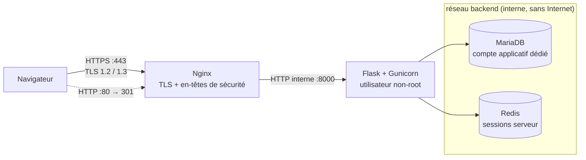

# 🔐 SecureAuth — Coffre-fort de documents classifiés


Application Web de **gestion de documents classifiés** (PUBLIC → TRÈS SECRET) construite
autour de l'authentification, du contrôle d'accès côté serveur et de la cryptographie.
Projet 2 du module Cybersécurité (TEK-UP) : *Système sécurisé d'authentification et de cryptographie*.

> L'authentification n'est que la porte d'entrée. Le cœur du projet : **décider qui peut lire
> quel document, le faire respecter côté serveur, et le prouver.**

## Sommaire

- [Principes de sécurité](#principes-de-sécurité)
- [Architecture](#architecture)
- [Cryptographie](#cryptographie)
- [Avancement](#avancement)
- [Installation](#installation)
- [Tests](#tests)
- [Structure du dépôt](#structure-du-dépôt)
- [Modèle de menace](#modèle-de-menace)
- [Limites assumées](#limites-assumées)

## Principes de sécurité

| Principe | Mise en œuvre |
|---|---|
| **Pas de lecture vers le haut** (Bell-LaPadula) | Un agent ne lit jamais un document dont la classification dépasse son habilitation |
| **Besoin d'en connaître** | L'habilitation ne suffit pas : il faut figurer sur la liste d'accès du document |
| **Séparation des rôles** | L'administrateur gère comptes et habilitations mais **n'est pas un super-lecteur** |
| **Décision unique** | Toutes les autorisations passent par un seul module (`security/policy.py`) |
| **Pas de fuite d'existence** | Document non autorisé ⇒ HTTP **404**, jamais 403 |
| **Défense en profondeur** | TLS, sessions serveur, CSRF, CSP stricte, chiffrement AES-GCM, journal HMAC chaîné |

## Architecture



| Composant | Rôle |
|---|---|
| **Nginx** | Seul point d'entrée publié (80/443), terminaison TLS, en-têtes de sécurité |
| **Flask + Gunicorn** | Application, port 8000 interne uniquement, utilisateur non-root |
| **MariaDB 11.4** | Données, réseau `backend` uniquement, compte limité à sa base |
| **Redis 7** | Sessions côté serveur (révocables) ; limitation de débit prévue |

Le réseau `backend` est `internal: true` (aucun accès Internet). L'application ne reçoit
**jamais** le mot de passe root de la base.

## Cryptographie

| Besoin | Mécanisme |
|---|---|
| Mots de passe | **Argon2id**, hash factice pour un temps de réponse identique (anti-énumération) |
| Documents | **AES-256-GCM**, nonce aléatoire unique ; `public_id`, classification et propriétaire scellés comme données associées (AAD) : changer la classification en base rend le déchiffrement impossible |
| Journal d'audit | **HMAC-SHA256 chaîné** : modifier, supprimer ou réordonner une ligne est détecté |
| Transport | TLS 1.2/1.3 avec mini-PKI OpenSSL (CA locale) |

Bibliothèques : `argon2-cffi` et `cryptography` uniquement, **aucun algorithme maison**.
Les clés (256 bits, distinctes) vivent hors de la base et sont validées au démarrage.

## Avancement

| Semaine | Phase | État |
|---|---|---|
| 1 | Infrastructure (Docker, TLS, Nginx, MariaDB, Redis, configuration) | ✅ Terminée |
| 2 | Authentification | 🔄 En cours : modèle de données ✅, Argon2id + politique ✅ (20 tests) ; journal d'audit, inscription, connexion, sessions à venir |
| 3 | Autorisation + chiffrement des documents | ⏳ |
| 4 | Tests de sécurité (25 cas) | ⏳ |
| 5 | Corrections, limitation de débit | ⏳ |
| 6 | Livraison, démonstration | ⏳ |

## Installation

Prérequis : Docker Desktop (ou Docker Engine + Compose v2) et OpenSSL.
Sous Windows, lancez les scripts `.sh` depuis **Git Bash** ou **WSL**.

```bash
# 1. Secrets aléatoires (crée .env, ignoré par git)
bash scripts/gen_secrets.sh

# 2. Mini-PKI : CA locale + certificat serveur
bash scripts/gen_certs.sh
openssl verify -CAfile pki/ca.crt nginx/certs/server.crt     # attendu : OK

# 3. Démarrage des 4 conteneurs
docker compose up -d --build
docker compose ps                                            # attendu : healthy

# 4. Création des tables
docker compose exec app flask --app wsgi init-db
```

Vérification (importez `pki/ca.crt` dans votre magasin de confiance pour le cadenas) :

```bash
curl --cacert pki/ca.crt https://localhost/health
# {"checks":{"database":"ok","redis":"ok"},"status":"ok"}
```

> ⚠️ Régénérer `.env` change les clés : les documents déjà chiffrés deviennent illisibles.
> Après un changement de schéma en développement : `docker compose down -v` puis relancer les étapes 3 et 4.

## Tests

```bash
python -m venv .venv
.venv/Scripts/activate            # Linux/macOS : source .venv/bin/activate
pip install -r app/requirements-dev.txt
cd app && python -m pytest -v
```

Les tests utilisent SQLite en mémoire et Redis simulé (`fakeredis`) : aucun secret réel,
aucun conteneur requis.

## Structure du dépôt

```
secure-auth-platform/
├── docker-compose.yml
├── .env.example                 # modèle ; le vrai .env est généré et ignoré par git
├── nginx/nginx.conf             # TLS, redirection 301, en-têtes de sécurité
├── scripts/                     # gen_secrets.sh, gen_certs.sh
└── app/
    ├── Dockerfile
    ├── requirements.txt / requirements-dev.txt
    ├── wsgi.py
    ├── secureauth/
    │   ├── config.py            # secrets obligatoires, clés 256 bits validées
    │   ├── models.py            # users, secure_documents, document_access, audit_logs, audit_chain_head
    │   ├── security/passwords.py
    │   └── cli.py               # flask init-db
    └── tests/
```

## Modèle de menace

| Menace | Contre-mesure |
|---|---|
| Énumération de comptes | Message d'erreur unique, hash factice |
| Force brute | Argon2id, verrouillage après 5 échecs, limitation de débit |
| Vol / fixation de session | Cookie `__Host-sid` (Secure, HttpOnly, SameSite=Lax), régénération à la connexion |
| CSRF | Jeton Flask-WTF + SameSite |
| IDOR, lecture vers le haut | `policy.can_read()` systématique, 404 uniforme |
| Abus de l'administrateur | Séparation des rôles, auto-modification interdite, tout est journalisé |
| Accès direct à la base | Chiffrement AES-256-GCM, clé hors base |
| Déclassement frauduleux | Classification scellée dans les données associées GCM |
| Effacement de traces | Chaîne HMAC + tête de chaîne |
| Injection SQL, XSS | ORM SQLAlchemy, échappement Jinja2, CSP stricte |

## Limites assumées

- Un attaquant qui modifie directement `clearance_level` en base n'est pas détecté (amélioration envisagée : tag HMAC sur les habilitations).
- Le verrouillage de compte peut être utilisé pour du déni de service ciblé (atténué par la limitation de débit).
- Un administrateur peut, de concert avec un complice, élever son habilitation et lui donner accès : l'action est journalisée mais pas empêchée.
- La CA locale n'a ni CRL ni OCSP.
- Hors périmètre : téléversement de fichiers, MFA, *no write down*, rotation des clés, API publique.

## Licence

Projet académique : usage pédagogique.
